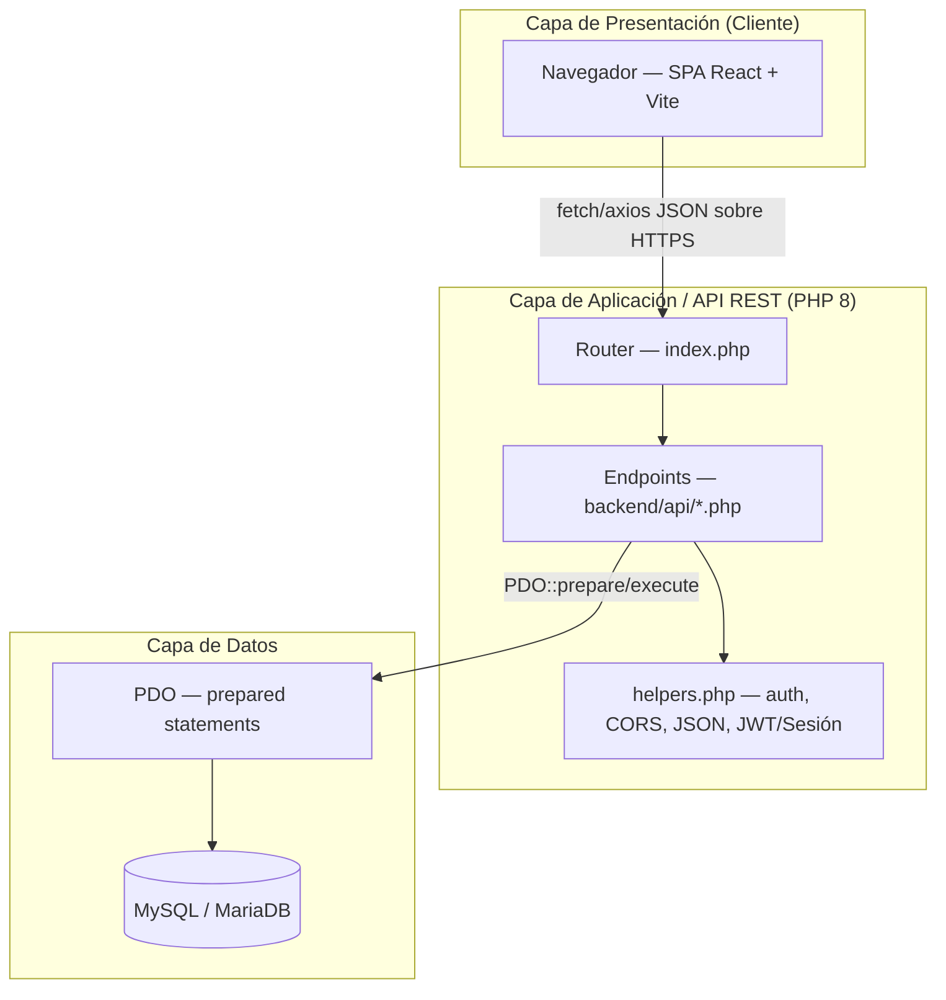

# Documentación técnica — Sistemas municipales/hospitalarios

Este directorio documenta, con fines académicos (tesis), los tres sistemas
alojados en este repositorio. Cada sistema es una aplicación independiente
(base de datos, backend y frontend propios) que comparte el mismo patrón
arquitectónico y stack tecnológico, pero resuelve un dominio de negocio
distinto:

| Sistema | Carpeta | Dominio | Documento |
|---|---|---|---|
| Control de Stock de Farmacia | `farmacia/` | Gestión de inventario de medicamentos de una farmacia hospitalaria (lotes, vencimientos, dispensas a pacientes) | [`farmacia-control-stock.md`](./farmacia-control-stock.md) |
| Turnos Prioritarios | `turnos-prioritarios/` | Agenda de turnos médicos con prioridad clínica para instituciones de salud | [`turnos-prioritarios.md`](./turnos-prioritarios.md) |
| Control de Combustible | `fuel-control/` | Gestión de carga de combustible, lubricantes, rutas y costos de la flota de un municipio | [`fuel-control.md`](./fuel-control.md) |

> Nota: estos son sistemas en producción activa, no versiones "finales" ni
> académicas — el código refleja decisiones pragmáticas de un contexto real
> (municipio / hospital), con deuda técnica visible en algunos puntos que se
> señala explícitamente en cada documento.

## 1. Arquitectura común a los tres sistemas

Los tres proyectos siguen la misma arquitectura en capas, tipo **API REST
desacoplada** (backend PHP sin framework + frontend SPA en React), servida
por un único proceso PHP embebido/Apache por proyecto:



Capas, de arriba hacia abajo:

1. **Presentación (frontend SPA)** — React 18 + React Router 6, construida
   con Vite. Consume la API exclusivamente vía `fetch`/`axios` en formato
   JSON; no hay renderizado en servidor (no SSR). El estado de sesión vive
   en un `Context` de React (`AuthContext`) y se persiste en `localStorage`
   (JWT) o en la cookie de sesión de PHP, según el sistema.
2. **Aplicación / API (backend PHP)** — cada carpeta `backend/api/<recurso>.php`
   es, a la vez, el controlador y el "router" de un recurso REST: recibe el
   método HTTP (`GET/POST/PUT/DELETE`), valida y despacha a funciones PHP
   locales con `match()`. No hay un framework (Laravel/Symfony) ni ORM: es
   PHP 8 "vanilla" con funciones puras por archivo.
3. **Acceso a datos** — `PDO` (PHP Data Objects) con *prepared statements*
   parametrizados (`?`) para evitar inyección SQL, `PDO::ATTR_EMULATE_PREPARES
   = false` (usa prepares nativos de MySQL) y `PDO::ERRMODE_EXCEPTION`.
   No hay capa ORM/Repository explícita: las consultas SQL viven directamente
   en cada endpoint.
4. **Persistencia** — MySQL/MariaDB, un esquema por sistema (`stock_control`,
   `turnos_prioritarios`, `fuel_control`), con integridad referencial vía
   `FOREIGN KEY` y *soft deletes* (columna `active`/`activo`) en vez de
   `DELETE` físico en las entidades principales.

## 2. Lenguajes y tecnologías (stack común)

| Capa | Tecnología | Detalle |
|---|---|---|
| Frontend | **JavaScript (JSX) + React 18** | `react-router-dom` 6 (ruteo SPA), `axios` (HTTP), CSS plano (sin Tailwind/UI kit) |
| Build tool | **Vite 5** | `npm run build` genera `frontend/dist/` (bundle estático servido por PHP) |
| Backend | **PHP 8** (`match`, tipado de parámetros/retorno, `readonly` no usado pero sí *union types* como `mixed`) | Sin framework; router manual por `index.php` |
| Acceso a datos | **PDO** (driver `mysql`) | Prepared statements, sin ORM |
| Base de datos | **MySQL / MariaDB** (`utf8mb4`, motor `InnoDB`) | Un esquema por sistema |
| Autenticación | **Sesiones PHP con cookie httpOnly** (farmacia) o **JWT propio hecho a mano** (turnos-prioritarios y fuel-control) | Ver detalle en cada documento |
| Despliegue | **Bash + rsync/ssh** (`deploy/deploy.sh`) disparado desde **GitHub Actions** | Build del frontend + copia de `backend/api` y `backend/config` a un VPS (Hostinger) corriendo Apache |

Los tres backends **no comparten código entre sí** (cada uno tiene su propio
`helpers.php`, `config/database.php`, etc.) — son monolitos PHP independientes
desplegados como subcarpetas del mismo servidor Apache (`/farmacia`,
`/turnos-prioritarios`, `/fuel-control`), aunque **comparten servidor MySQL**:
`turnos_prioritarios` referencia por `id` (sin `FOREIGN KEY` real, por ser
bases de datos distintas) a la tabla `personas` de la base `stock_control`
del sistema de farmacia — el mismo padrón de ~96.000 personas se reutiliza
como padrón único de pacientes/beneficiarios entre ambos sistemas.

## 3. Estructura de carpetas (idéntica en los tres proyectos)

```
<sistema>/
├── backend/
│   ├── config/
│   │   └── database.php        # constantes DB_*, JWT_SECRET, getDB(): PDO
│   ├── api/
│   │   ├── helpers.php         # CORS, JSON, auth, (JWT en 2 de los 3)
│   │   ├── auth.php            # login/logout/me
│   │   └── <recurso>.php       # 1 archivo = 1 recurso REST
│   └── index.php               # enruta /api/* y sirve el SPA (fallback)
├── frontend/
│   ├── src/
│   │   ├── context/AuthContext.jsx
│   │   ├── pages/*.jsx         # 1 archivo = 1 pantalla/recurso
│   │   ├── App.jsx             # rutas + layout (sidebar)
│   │   └── main.jsx
│   ├── vite.config.js
│   └── package.json
└── database/ (o backend/migrations/)
    └── schema.sql
```

## 4. Despliegue

`deploy/deploy.sh <proyecto>` arma un bundle (`frontend/dist` compilado +
`backend/api` + `backend/config`) y lo sincroniza por `rsync`/`ssh` a
`/var/www/html/<proyecto>` en un VPS. Se dispara automáticamente desde
GitHub Actions (`.github/workflows/`) en cada push a `main`. El archivo
`config/database.php` de producción **nunca se sobreescribe** por el deploy:
la primera vez se crea desde `database.php.dist`, y luego el pipeline lo
respeta para no pisar credenciales reales.

---

Ver el detalle de cada sistema (DER completo, endpoints, flujos de negocio
internos) en su documento correspondiente.
