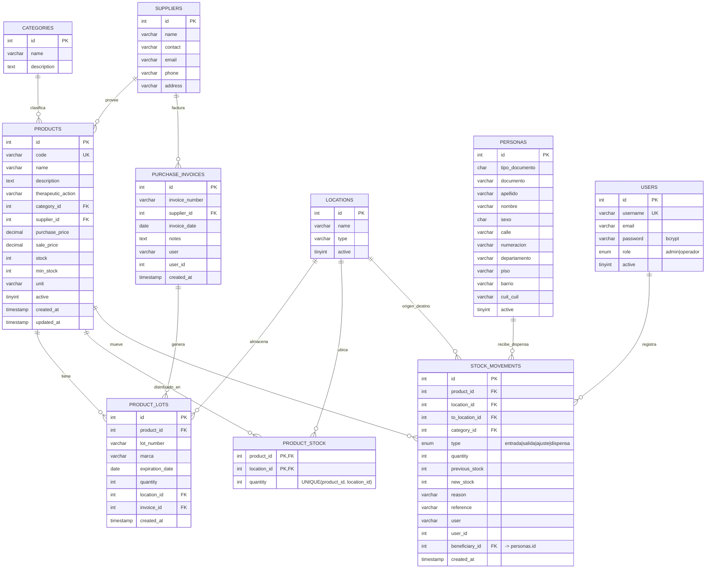

# Sistema de Control de Stock de Farmacia (`farmacia/`)

## 1. Propósito

Gestiona el inventario de medicamentos de una farmacia hospitalaria: altas de
stock por factura de compra, control de lotes con fecha de vencimiento,
trazabilidad de movimientos (entradas, ajustes, dispensas), stock distribuido
por ubicación física (depósito, consultorio, etc.) y dispensación de
medicamentos a personas (pacientes/beneficiarios) identificadas por
documento. Título interno de la SPA: **"Control de Stock"**. Base de datos:
`stock_control`.

## 2. Arquitectura en capas

```mermaid
flowchart TB
    subgraph FE["Frontend — React SPA (frontend/dist, build Vite)"]
        UI[Páginas: Dashboard, Productos, Lotes, Movimientos,\nDispensas, Facturas, Ubicaciones, Personas, Usuarios]
    end
    subgraph BE["Backend — PHP 8 (backend/)"]
        R[index.php\nrouter /api/*]
        H[api/helpers.php\nsession, CORS, JSON, requireAuth/requireAdmin,\nadjustProductStock()]
        EP["api/*.php\nauth · products · lotes · movimientos ·\ndispensas · facturas · ubicaciones ·\npersonas · categorias · proveedores · users · reportes · dashboard"]
    end
    subgraph DB["MySQL — stock_control"]
        T[(products · product_lots · product_stock ·\nstock_movements · categories · suppliers ·\nlocations · purchase_invoices · personas · users)]
    end

    UI -- "axios GET/POST/PUT/DELETE\n/farmacia/api/*.php" --> R
    R --> EP
    EP --> H
    EP -- "PDO prepared statements\n+ transacciones" --> T
```

- **Presentación**: SPA React 18 servida como *bundle estático* (`frontend/dist/assets/app.js`).
  A diferencia de los otros dos sistemas, en este repositorio **solo está
  commiteado el build de producción**, no el código fuente `src/*.jsx`
  (`deploy/deploy.sh` lo detecta y copia el `dist/` tal cual sin recompilar).
  El `index.html` monta la app en `<div id="root">` y carga `app.js` como
  módulo ES.
- **Aplicación (API)**: 19 endpoints PHP bajo `backend/api/`, uno por
  recurso. `backend/index.php` resuelve `/api/<recurso>` → `api/<recurso>.php`
  por nombre de archivo (`basename`), y si no es ruta `/api/*` sirve el SPA
  (`index.html`) para que el ruteo lo resuelva `react-router-dom` en el
  cliente.
- **Datos**: PDO sobre MySQL (`stock_control`), con transacciones explícitas
  (`beginTransaction/commit/rollBack`) en toda operación que toca stock
  (alta de lote, dispensa, factura, movimiento) para mantener consistentes
  `products.stock`, `product_stock` (por ubicación) y el historial en
  `stock_movements`.

### Detalle notable: endpoints duplicados ES/EN

El backend tiene **dos versiones de varios recursos**, una en español
(`categorias.php`, `proveedores.php`, `usuarios.php`, `ubicaciones.php`,
`movimientos.php`) y otra en inglés (`categories.php`, `suppliers.php`,
`users.php`, `locations.php`, `movements.php`). Son implementaciones
paralelas del mismo CRUD sobre las mismas tablas; las versiones en español
son las más completas y las que consume el frontend actual (p. ej.
`ubicaciones.php` agrega `stockByLocation()`, que `locations.php` no tiene).
Esto es deuda técnica heredada de una migración de nomenclatura — para la
tesis, vale la pena señalarlo como ejemplo de duplicación de código a
refactorizar (unificar en un solo archivo por recurso).

## 3. Lenguaje y tecnologías específicas

- **Backend**: PHP 8 (`match`, tipado `PDO`, `mixed`, `?int`), sin
  framework. Contraseñas con `password_hash`/`password_verify` (bcrypt).
- **Autenticación**: **sesión PHP nativa** (`session_start()`, cookie
  `httponly`, `samesite=Lax`) — `$_SESSION['user']` guarda
  `{sub, id, username, email, role}`. No usa JWT (a diferencia de los otros
  dos sistemas). `requireAuth()` valida que exista sesión; `requireAdmin()`
  exige además `role === 'admin'`.
- **Frontend**: React 18 + Vite (bundle ya compilado), consumo de PDF con
  `pdf.js` (assets `pdf.js`, `pdf.worker.min.js`) — usado para generar/leer
  comprobantes o reportes en PDF (probablemente impresión de dispensas o
  facturas).
- **CORS**: `Access-Control-Allow-Origin: *` (abierto), típico de un deploy
  donde frontend y backend se sirven desde el mismo dominio en producción.

## 4. Modelo de datos (DER)

> No existe un archivo `.sql` de esquema commiteado para este sistema (a
> diferencia de los otros dos) — el DER siguiente se reconstruyó a partir de
> las consultas SQL reales en `backend/api/*.php`.



**Notas sobre el modelo:**

- `products.stock` es un **campo desnormalizado** (total agregado) que se
  recalcula manualmente en cada operación (`UPDATE products SET stock = ?`),
  en paralelo a `product_stock` (desglose por ubicación) y a la fila que se
  inserta en `stock_movements` (historial). No hay un trigger de base de
  datos que garantice la consistencia entre las tres — la consistencia es
  responsabilidad del código PHP dentro de una transacción.
- `stock_movements.type = 'dispensa'` es el tipo especial que representa la
  entrega de medicamentos a una `persona` (paciente/beneficiario); todas las
  filas de una misma dispensa comparten `reference` (formato
  `DISP-YYYYMMDDHHMMSS-P<persona_id>`), lo que simula un encabezado de
  "pedido" sin necesidad de una tabla `dispensas` separada — se reconstruye
  agrupando (`GROUP BY reference`) sobre `stock_movements`.
- `personas` es la tabla compartida con `turnos-prioritarios` (ver
  documento de ese sistema) — ~96.000 registros según el comentario de
  `turnos-prioritarios/database/schema.sql`.
- `product_lots.invoice_id` vincula el lote a la factura de compra que lo
  generó (si vino de `facturas.php`); puede ser `NULL` si el lote se cargó
  manualmente desde `lotes.php`.

## 5. Funcionamiento interno — flujos de negocio clave

### 5.1 Alta de stock por lote (`lotes.php::createLote`)

1. Valida que el producto exista y esté activo.
2. **Transacción**:
   - Inserta fila en `product_lots` (número de lote, vencimiento, cantidad, ubicación).
   - Suma la cantidad a `products.stock`.
   - Llama a `adjustProductStock()` (`helpers.php:67`) para sumar en
     `product_stock` con `INSERT ... ON DUPLICATE KEY UPDATE quantity =
     GREATEST(0, quantity + ?)` — evita stock negativo por ubicación.
   - Inserta movimiento `type='entrada'`, `reference = 'LOTE-<id>'`.
3. Si algo falla, `rollBack()` deja todo sin cambios (atomicidad).

### 5.2 Alta de stock por factura de compra (`facturas.php::createFactura`)

Igual al flujo anterior pero **multi-ítem**: crea un encabezado en
`purchase_invoices` y, por cada ítem del body, repite el mismo patrón
(lote + stock total + stock por ubicación + movimiento con
`reference = 'FAC-<invoice_id>'`). `deleteFactura()` es el flujo inverso:
revierte cada lote asociado (resta stock, no borra el historial de
movimientos).

### 5.3 Dispensa a un paciente (`dispensas.php::createDispensa`)

1. Valida que la `persona` (paciente) exista y esté activa.
2. Por cada ítem, valida stock suficiente (`product.stock >= cantidad`) —
   **rechaza toda la operación si un solo ítem no tiene stock**, antes de
   tocar la base de datos.
3. Genera una `reference` única (`DISP-<timestamp>-P<persona_id>`).
4. **Transacción**: por cada ítem, resta de `products.stock`, resta de
   `product_stock` (ubicación de origen) y agrega un `stock_movement` con
   `type='dispensa'` y `beneficiary_id = persona_id`.
5. No existe entidad "Dispensa" en la base — es un agregado lógico sobre
   `stock_movements` agrupado por `reference` (ver `listDispensas`/`getDispensa`).

### 5.4 Movimiento manual (`movimientos.php::createMovimiento`)

Soporta dos tipos desde la UI: `entrada` (suma stock y lo distribuye a una
ubicación) y `ajuste` (fija `products.stock` al valor indicado sin tocar la
distribución por ubicación — para correcciones de inventario físico, p. ej.
tras un conteo). El `salida` normal de stock ocurre exclusivamente vía
`dispensas.php` (no hay "salida" libre sin beneficiario en el flujo actual).

### 5.5 Dashboard y alertas (`dashboard.php`)

Agrega en una sola respuesta: total de productos activos, productos en/bajo
`min_stock`, productos sin stock, valorización del inventario
(`SUM(stock * purchase_price)`), movimientos de los últimos 7 días agrupados
por día (para gráfico de entradas/salidas), y lotes que vencen dentro de 30
días (`DATEDIFF(expiration_date, CURDATE())`). Tiene manejo defensivo por
`try/catch` para tolerar instalaciones donde la columna de vencimiento se
llama `expiration_date` (esquema nuevo) o `expiry_date` (dump histórico de
XAMPP) — evidencia de que este sistema migró de un entorno local (XAMPP/Windows)
a producción.

### 5.6 Reportes (`reportes.php`)

Cuatro reportes parametrizados por `?type=`: `stock` (inventario valorizado),
`vencimientos` (lotes por vencer, parametrizable en días), `dispensas`
(dispensas en un rango de fechas, con ítems anidados) y `movimientos`
(historial crudo). Todos requieren sesión autenticada (`requireAuth()` a
nivel de archivo).

## 6. Endpoints de la API (resumen)

| Recurso | Archivo | Métodos | Notas |
|---|---|---|---|
| Autenticación | `auth.php` | `POST ?action=login`, `GET ?action=me`, `POST ?action=logout` | Sesión PHP |
| Productos | `products.php` / `medicamentos.php` | GET, POST, PUT, DELETE(soft) | Filtros: `search`, `category_id`, `low_stock` |
| Lotes | `lotes.php` | GET, POST, DELETE | Filtros: `expiring_days`, `expired` |
| Movimientos | `movimientos.php` / `movements.php` | GET, POST | `type`: entrada, ajuste |
| Dispensas | `dispensas.php` | GET, POST | Agregado sobre `stock_movements` |
| Facturas | `facturas.php` | GET, POST, DELETE | Genera lotes + revierte stock al borrar |
| Ubicaciones | `ubicaciones.php` / `locations.php` | GET, POST, PUT, DELETE | `?stock=1` → stock agregado por ubicación |
| Personas | `personas.php` | GET, POST, PUT, DELETE(soft) | Padrón compartido con turnos-prioritarios |
| Categorías | `categorias.php` / `categories.php` | GET, POST, PUT, DELETE | Bloquea borrado si tiene productos |
| Proveedores | `proveedores.php` / `suppliers.php` | GET, POST, PUT, DELETE | Ídem |
| Usuarios | `users.php` / `usuarios.php` | GET, POST, PUT, DELETE(soft) | Solo admin (`requireAdmin`) |
| Dashboard | `dashboard.php` | GET | KPIs + alertas |
| Reportes | `reportes.php` | GET `?type=` | stock, vencimientos, dispensas, movimientos |

## 7. Seguridad

- Contraseñas con `password_hash(..., PASSWORD_BCRYPT)`.
- SQL parametrizado en el 100% de las consultas revisadas (`PDO::prepare` +
  `execute([...])`) — sin concatenación de input de usuario en SQL.
- Autorización de dos niveles: `requireAuth()` (cualquier usuario logueado)
  y `requireAdmin()` (rol `admin`) para operaciones sensibles (usuarios,
  ubicaciones).
- *Soft delete* (`active = 0`) en `products`, `personas`, `users` —
  preserva integridad referencial histórica en `stock_movements`.
- `CORS: Access-Control-Allow-Origin: *` — sin restricción de origen (punto
  a mejorar si se expone fuera de la red del hospital).
