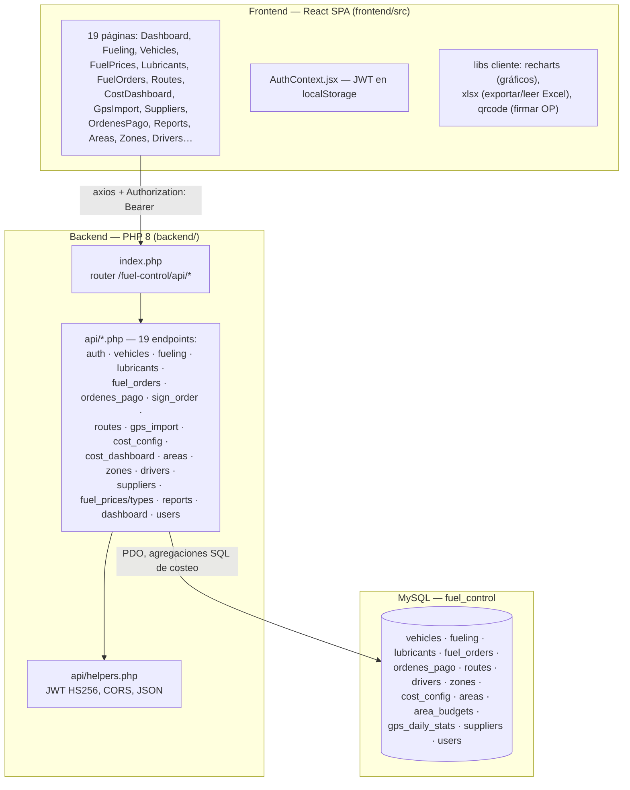

# Sistema de Control de Combustible (`fuel-control/`)

## 1. Propósito

Gestiona la carga de combustible y lubricantes de la flota de vehículos y
maquinaria de un municipio (Municipalidad de Cosquín, según el logo servido
por el frontend), el costeo de rutas de recolección de residuos por zona,
presupuestos por área municipal, importación de estadísticas GPS
(AmericaGIS) y órdenes de pago a proveedores de combustible. Es el sistema
**más grande y complejo de los tres** (19 endpoints backend, 19 páginas
frontend). Base de datos: `fuel_control`.

## 2. Arquitectura en capas

- **Presentación**: React 18 SPA con fuente completa en `frontend/src/`.
  Además del stack común, suma librerías específicas del dominio:
  `recharts` (gráficos del tablero de costos), `xlsx` (exportación/lectura
  de planillas — usado en la importación de GPS y reportes) y `qrcode`
  (generación de códigos QR, usados para firmar/validar órdenes de pago,
  ver `sign_order.php`).
- **Aplicación (API)**: mismo patrón — un archivo por recurso. Es el backend
  con más lógica de negocio "pesada" en SQL: `cost_dashboard.php` calcula
  costo por tonelada/km de cada vehículo con subconsultas correlacionadas
  (ver §5.3).
- **Datos**: esquema más grande de los tres sistemas — 14 tablas, construidas
  incrementalmente en **tres archivos SQL separados** más dos migraciones,
  reflejando el crecimiento del sistema en el tiempo:
  - `database/schema.sql` — núcleo original (usuarios, vehículos, cargas,
    lubricantes, precios).
  - `database/fuel_orders.sql` — módulo de "órdenes de carga" agregado después.
  - `database/routes_schema.sql` — módulo de rutas de recolección + GPS,
    agregado después.
  - `backend/migrations/areas.sql`, `backend/migrations/ordenes_pago.sql` —
    migraciones con `ALTER TABLE ... ADD COLUMN IF NOT EXISTS` (patrón
    idempotente, pensado para poder re-ejecutarse sin romper una base ya
    migrada — importante porque no hay herramienta de migraciones tipo
    Flyway/Laravel Migrations, son scripts `.sql` manuales).

## 3. Lenguaje y tecnologías específicas

- **Backend**: PHP 8, sin framework, mismo patrón que los otros dos sistemas.
- **Autenticación**: **JWT propio** (idéntica implementación a
  turnos-prioritarios: `helpers.php` con `jwtEncode`/`jwtDecode` manuales,
  HMAC-SHA256, `JWT_EXPIRY = 8 * 3600`). Además define `QR_SECRET`
  (`config/database.php:10`), una clave separada usada para firmar/validar
  el QR de las órdenes de pago (`sign_order.php`) — es decir, dos secretos
  distintos para dos propósitos distintos (sesión vs. firma de documento).
- **Usuario de base de datos dedicado**: a diferencia de los otros dos
  sistemas (que usan `root`), fuel-control define `DB_USER = 'fuel_user'`
  — un usuario MySQL con privilegios acotados a esta base, mejor práctica
  de aislamiento.
- **Frontend**: React 18 + Vite + `react-router-dom` + `axios` +
  `recharts` + `xlsx` + `qrcode`.

## 4. Modelo de datos (DER)

```mermaid
erDiagram
    AREAS ||--o{ VEHICLES : agrupa
    AREAS ||--o{ AREA_BUDGETS : presupuesta
    VEHICLES ||--o{ FUELING : carga
    VEHICLES ||--o{ LUBRICANTS : recibe
    VEHICLES ||--o{ FUEL_ORDERS : solicita
    VEHICLES ||--o{ COST_CONFIG : costea
    VEHICLES ||--o{ ROUTES : recorre
    VEHICLES ||--o{ GPS_DAILY_STATS : reporta
    USERS ||--o{ FUELING : carga_operador
    USERS ||--o{ LUBRICANTS : aplica_operador
    USERS ||--o{ FUEL_ORDERS : ordena_operador
    USERS ||--o{ ROUTES : registra_operador
    USERS ||--o{ GPS_DAILY_STATS : importa
    USERS ||--o{ FUEL_PRICES : fija_precio
    DRIVERS ||--o{ ROUTES : conduce
    ZONES ||--o{ ROUTES : ubica
    SUPPLIERS ||--o{ ORDENES_PAGO : cobra
    ORDENES_PAGO ||--o{ FUELING : agrupa_pago

    VEHICLES {
        int id PK
        varchar name
        varchar plate UK
        varchar type "Auto|Camioneta|Camión|Motoniveladora…"
        int area_id FK
        tinyint active
    }
    AREAS {
        int id PK
        varchar name
        text description
    }
    AREA_BUDGETS {
        int id PK
        int area_id FK
        smallint period_year
        tinyint period_month "1-12, NULL=anual"
        enum budget_type "litros|pesos"
        decimal budget_amount
    }
    FUELING {
        int id PK
        int vehicle_id FK
        int user_id FK
        decimal liters
        decimal km_recorridos
        decimal price_per_liter
        decimal total_cost
        varchar fuel_type
        varchar station
        varchar ticket_number
        int op_id FK "-> ordenes_pago"
        datetime fueled_at
    }
    LUBRICANTS {
        int id PK
        int vehicle_id FK
        int user_id FK
        varchar type
        varchar brand
        decimal quantity
        varchar unit
        decimal km_recorridos
        datetime applied_at
    }
    FUEL_ORDERS {
        int id PK
        int vehicle_id FK
        int user_id FK
        varchar fuel_type
        decimal liters_requested
        varchar driver_name
        enum status "pendiente|completada|cancelada"
        datetime ordered_at
    }
    ORDENES_PAGO {
        int id PK
        varchar numero_op
        int supplier_id FK
        date fecha
        enum estado "borrador|cerrada|pagada"
        varchar created_by
    }
    SUPPLIERS {
        int id PK
        varchar name
        varchar cuit
        varchar phone
        varchar email
        varchar address
        tinyint active
    }
    DRIVERS {
        int id PK
        varchar name
        varchar dni UK
        varchar phone
        varchar license_type
        date hire_date
        decimal hourly_cost
        tinyint active
    }
    ZONES {
        int id PK
        varchar name UK
        tinyint active
    }
    ROUTES {
        int id PK
        int vehicle_id FK
        int driver_id FK
        int zone_id FK
        int user_id FK
        datetime departure_at
        datetime arrival_at
        decimal km_start
        decimal km_end
        decimal fuel_liters
        int trips_to_dump
    }
    COST_CONFIG {
        int id PK
        int vehicle_id FK
        decimal insurance_monthly
        decimal depreciation_monthly
        decimal maintenance_per_km
    }
    GPS_DAILY_STATS {
        int id PK
        date import_date
        varchar vehicle_name
        varchar plate
        int vehicle_id FK
        decimal km_recorridos
        varchar tiempo_marcha
        varchar tiempo_ralenti
        varchar tiempo_detenido
        decimal vel_max
        decimal vel_prom
        int total_eventos
        int user_id FK
    }
    FUEL_PRICES {
        int id PK
        varchar fuel_type
        decimal price
        int user_id FK
    }
    FUEL_TYPES {
        int id PK
        varchar name UK
        tinyint active
    }
    LUBRICANT_TYPES {
        int id PK
        varchar name UK
        tinyint active
    }
    USERS {
        int id PK
        varchar username UK
        varchar password "bcrypt"
        enum role "admin|operator"
        tinyint active
    }
```

**Notas sobre el modelo:**

- `fuel_types` y `lubricant_types` son catálogos editables (no ENUM fijo en
  `fueling`/`lubricants`, que guardan el nombre como `varchar` libre) —
  permite agregar tipos nuevos sin migrar el esquema, a costa de no tener
  integridad referencial estricta entre `fueling.fuel_type` y
  `fuel_types.name` (son strings, no hay `FOREIGN KEY` entre ellos).
- `area_budgets` tiene `UNIQUE(area_id, period_year, period_month)` —
  modela tanto presupuesto **mensual** (`period_month` 1-12) como **anual**
  (`period_month = NULL`) en la misma tabla.
- `gps_daily_stats` tiene una clave de deduplicación implícita usada en el
  `ON DUPLICATE KEY UPDATE` de `gps_import.php` (reimportar el mismo día
  actualiza en vez de duplicar).
- `ordenes_pago.id` se referencia desde `fueling.op_id` (agrega múltiples
  cargas de combustible bajo una misma orden de pago a un proveedor) — la
  columna se agregó con una migración (`ALTER TABLE fueling ADD COLUMN IF
  NOT EXISTS op_id ...`), evidencia de que el sistema evolucionó
  incrementalmente sobre datos ya en producción.

## 5. Funcionamiento interno — flujos de negocio clave

### 5.1 Registro de carga de combustible (`fueling.php`)

`POST` calcula `total_cost = price_per_liter * liters` en el propio backend
(no confía en un total enviado por el cliente), y guarda `fueled_at`
(fecha real de la carga, puede diferir de `created_at` si se carga en
diferido). Filtros de listado por vehículo, área (`JOIN vehicles`), rango
de fechas y patente (`LIKE`). El `DELETE` requiere rol `admin`
(`requireAdmin()`), a diferencia de `GET`/`POST`/`PUT` que solo requieren
sesión válida — refleja que borrar una carga (afecta reportes de costos
históricos) es más sensible que crearla.

### 5.2 Importación de estadísticas GPS (`gps_import.php`)

Recibe un array de filas (`rows`, típicamente parseadas en el frontend
desde un Excel con `xlsx` antes de enviarlas como JSON) provenientes del
sistema externo **AmericaGIS**. Por cada fila:

1. Normaliza número (coma decimal → punto: `str_replace(',', '.', ...)`,
   típico de datos exportados en configuración regional es-AR).
2. Resuelve `vehicle_id` matcheando la patente (`plate`) contra un mapa
   `plate → id` precomputado de la tabla `vehicles` (evita N consultas).
3. `INSERT ... ON DUPLICATE KEY UPDATE` — reimportar el mismo
   `import_date` + vehículo actualiza en vez de duplicar.
4. Al final, una consulta de reconciliación (`UPDATE gps_daily_stats g JOIN
   vehicles v ON UPPER(TRIM(v.plate)) = UPPER(TRIM(g.plate)) ...`)
   vincula por patente los registros que quedaron sin `vehicle_id`
   (p. ej. si el vehículo se dio de alta en el sistema *después* de una
   importación GPS anterior).

### 5.3 Tablero de costos (`cost_dashboard.php`) — el cálculo más complejo del sistema

Por cada vehículo, en un rango de fechas, calcula el **costo total de
operación por tonelada y por km** combinando cuatro componentes en una sola
consulta SQL con subconsultas correlacionadas:

1. **Costo de personal** = horas de ruta (`TIMESTAMPDIFF(MINUTE,
   departure_at, arrival_at) / 60`) × `drivers.hourly_cost`.
2. **Costo de combustible** = litros cargados en la ruta (`routes.fuel_liters`)
   × precio promedio más reciente de ese vehículo (subconsulta a `fueling`
   ordenada por `fueled_at DESC LIMIT 1`, con `COALESCE(..., 0)` si no hay
   histórico).
3. **Costo de mantenimiento** = km recorridos × `cost_config.maintenance_per_km`.
4. **Costos fijos prorrateados** = `(insurance_monthly + depreciation_monthly)
   / km_totales_del_vehículo_ese_mes` × km de la ruta — es decir, distribuye
   el costo fijo mensual del vehículo proporcionalmente a cuánto se usó
   cada ruta dentro de ese mes (subconsulta que suma `km_end - km_start` de
   todas las rutas del mismo vehículo en el mismo mes/año).

El resultado expone `costo_por_tonelada` (toneladas estimadas como
`trips_to_dump * 8`, es decir, 8 toneladas por viaje al vertedero — una
constante de negocio hardcodeada) y `costo_por_km`, ambos `null` si no
aplica división por cero.

### 5.4 Firma de orden de pago (`sign_order.php`)

No se leyó el archivo completo, pero por el nombre y la presencia de
`QR_SECRET` en la configuración, el flujo es: generar un hash/firma HMAC de
los datos de la orden de pago con `QR_SECRET`, codificarlo en un QR
(librería `qrcode` del frontend) impreso en el comprobante, y permitir
validar posteriormente (por otro endpoint o de forma offline) que la orden
no fue alterada — un mecanismo de integridad documental simple, análogo a
una firma digital simétrica.

### 5.5 Presupuesto por área (`area_budgets` + `areas.php`/`area_budgets.php`)

Permite fijar un tope de litros o pesos por área municipal y período
(mensual o anual), para comparar contra el consumo real (`fueling` +
`vehicles.area_id`) — probablemente expuesto en `CostDashboard.jsx` o
`Reports.jsx` como % de presupuesto ejecutado.

## 6. Endpoints de la API (resumen)

| Recurso | Archivo | Notas |
|---|---|---|
| Autenticación | `auth.php` | JWT |
| Vehículos | `vehicles.php` | Flota, con `area_id` |
| Cargas de combustible | `fueling.php` | Cálculo de `total_cost` server-side |
| Lubricantes | `lubricants.php` | Aplicaciones de aceite/grasa/refrigerante |
| Tipos de combustible/lubricante | `fuel_types.php`, `lubricant_types.php` | Catálogos editables |
| Precios de combustible | `fuel_prices.php` | Histórico de precios por tipo |
| Órdenes de carga | `fuel_orders.php` | Solicitudes previas a la carga real |
| Órdenes de pago | `ordenes_pago.php`, `sign_order.php` | Agrupan `fueling` por proveedor; firma QR |
| Proveedores | `suppliers.php` | CUIT, contacto |
| Rutas | `routes.php` | Recolección de residuos por zona |
| Zonas | `zones.php` | Catálogo de barrios/zonas |
| Choferes | `drivers.php` | Costo horario |
| Config. de costos | `cost_config.php` | Seguro, depreciación, mantenimiento por vehículo |
| Tablero de costos | `cost_dashboard.php` | Cálculo agregado (§5.3) |
| Áreas y presupuestos | `areas.php`, `area_budgets.php` | Presupuesto litros/pesos |
| Importación GPS | `gps_import.php` | Integración con AmericaGIS |
| Reportes | `reports.php` | Exportables |
| KPIs auxiliares | `auto_km_per_liter.php`, `km_since_last_fuel.php` | Rendimiento y alertas de recarga |
| Dashboard | `dashboard.php` | KPIs generales |
| Usuarios | `users.php` | Solo admin |

## 7. Despliegue — particularidades

A diferencia de los otros dos sistemas, `fuel-control` define
`.deploy-backend-prefix` (backend servido bajo un subprefijo distinto de la
raíz del proyecto) y tiene *dos* copias de assets estáticos en el repo
(`fuel-control/assets/` con múltiples versiones hasheadas `index-*.js` y
`fuel-control/public/assets/`) — rastro de builds sucesivos commiteados
directamente (`.deploy-keep`), consistente con el historial de git
("Enable automatic deploy for fuel-control", "replace fuel-control backend
with real server content (secrets rotated)") que muestra que este proyecto
se sincronizó desde un servidor de producción existente hacia el repositorio,
en vez de nacer en el repositorio.

## 8. Seguridad

- JWT HS256 propio + `QR_SECRET` separado para firmar documentos — buena
  práctica de separar secretos por propósito.
- Usuario de MySQL dedicado (`fuel_user`) en vez de `root`.
- `DELETE` de cargas de combustible restringido a `admin`.
- SQL parametrizado (`PDO::prepare`, incluso con *named parameters*
  `:from`, `:to` en varios endpoints en vez de `?` posicional).
- Igual que en turnos-prioritarios, los valores de `JWT_SECRET`/`QR_SECRET`
  en el repo son placeholders (`'cambiar_en_produccion'`) — deben
  reemplazarse por secretos reales gestionados fuera del control de
  versiones en el servidor de producción.
