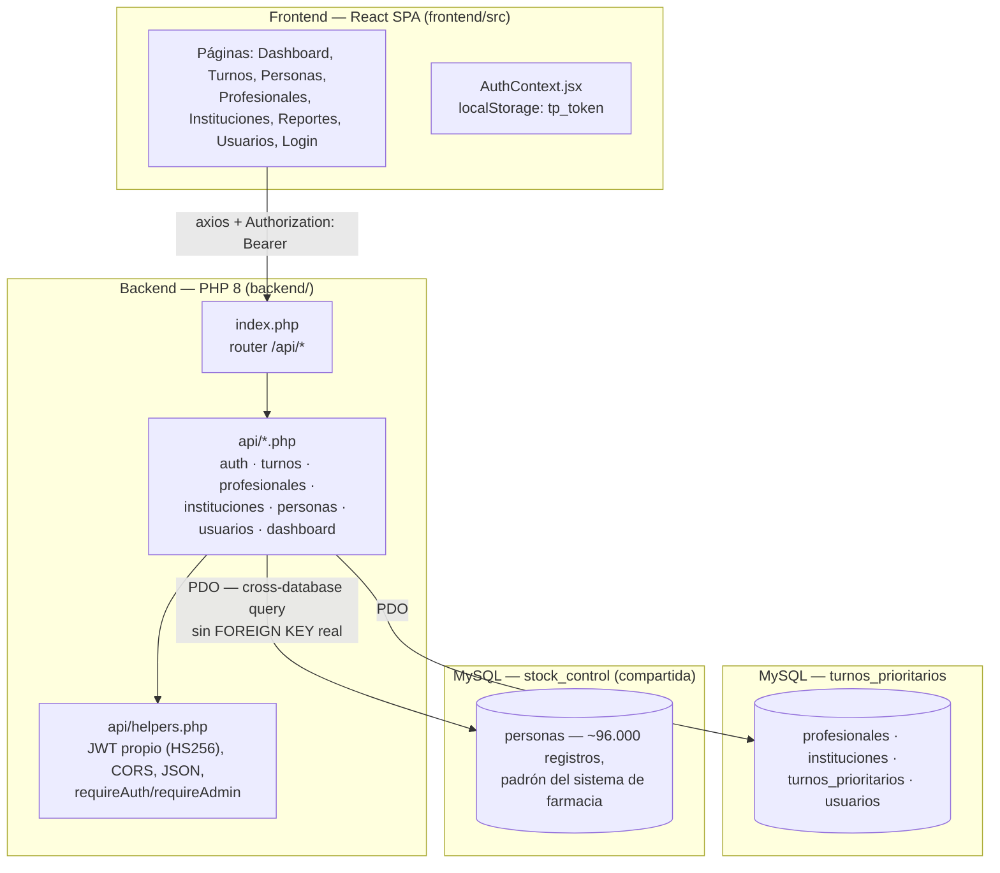
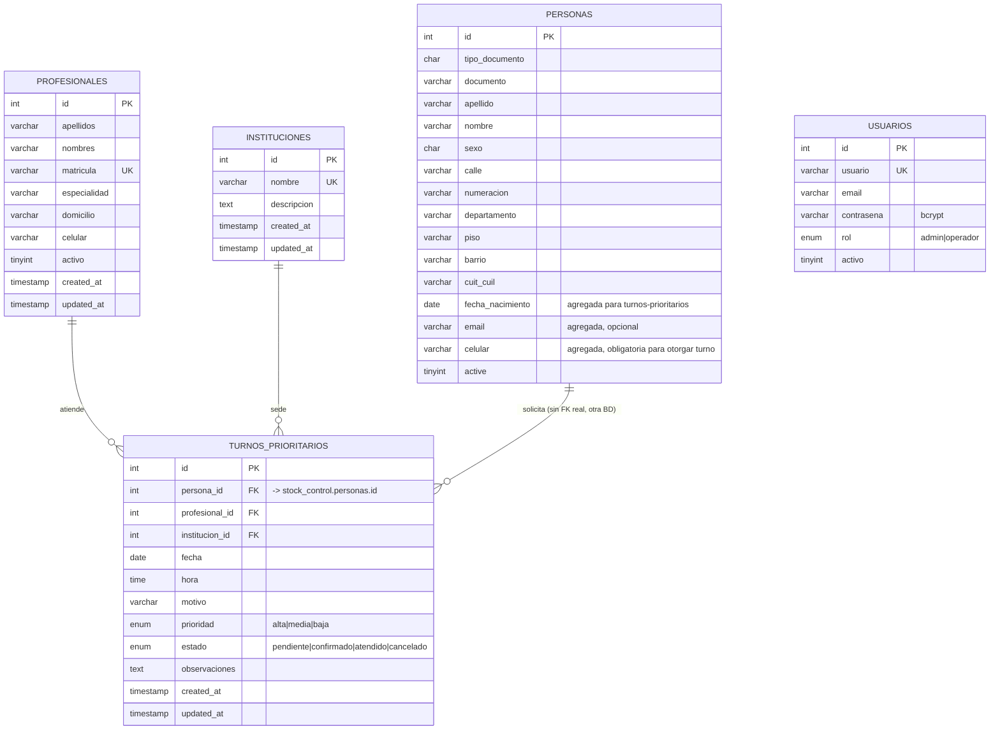

# Sistema de Turnos Prioritarios (`turnos-prioritarios/`)

## 1. Propósito

Agenda turnos médicos con **nivel de prioridad clínica** (alta/media/baja)
para personas atendidas en distintas instituciones de salud (Hospital Cima y
centros de salud asociados), asignados a profesionales médicos con
matrícula y especialidad. Es el sistema más pequeño de los tres, pensado
para uso administrativo (recepción/gestión de agenda), no para
autogestión del paciente. Además de la agenda, incluye confirmación de
turno por WhatsApp y reportes exportables en PDF (turnos pendientes por
profesional/especialidad, listado de profesionales). Base de datos:
`turnos_prioritarios`.

## 2. Arquitectura en capas

- **Presentación**: React 18 SPA con código fuente completo en el repo
  (`frontend/src/`), a diferencia de farmacia. Vite + `react-router-dom` +
  `axios`. El token JWT se persiste en `localStorage` (`tp_token`) y se
  valida contra el backend al montar la app (`GET /auth.php?action=me`).
- **Aplicación (API)**: mismo patrón que los otros sistemas — un archivo PHP
  por recurso bajo `backend/api/`, `index.php` enruta por nombre de
  endpoint. Autenticación por **JWT hecho a mano en PHP puro** (sin
  librerías externas como `firebase/php-jwt`), ver §5.
- **Datos**: **dos bases de datos MySQL en el mismo servidor**: la propia
  (`turnos_prioritarios`) y la de farmacia (`stock_control`), de la cual
  reutiliza la tabla `personas` mediante un nombre de tabla totalmente
  calificado (`` `stock_control`.`personas` ``) construido dinámicamente con
  la constante `PEOPLE_DB`. No hay `FOREIGN KEY` real entre bases (MySQL no
  lo permite entre schemas de forma nativa con garantías completas vía
  `PDO` simple), así que la integridad `persona_id` es responsabilidad de
  la aplicación.

## 3. Lenguaje y tecnologías específicas

- **Backend**: PHP 8, sin framework.
- **Autenticación**: **JWT propio** (`helpers.php:40-74`) — implementación
  manual de la especificación JWT (header.payload.signature en Base64URL,
  firma HMAC-SHA256 con `JWT_SECRET`), sin dependencias de Composer.
  `requireAuth()` lee el header `Authorization: Bearer <token>`
  (con fallback a `REDIRECT_HTTP_AUTHORIZATION` / `apache_request_headers()`
  para entornos Apache/XAMPP donde el header se pierde), decodifica y
  valida firma + expiración (`exp`). Duración: **8 horas**
  (`JWT_EXPIRY = 8 * 3600`).
- **Frontend**: React 18 + Vite, `axios` para HTTP.
- **Reportes en PDF**: `jsPDF` + `jspdf-autotable`, generados **enteramente
  en el navegador** (no hay librería de PDF en el backend PHP) — decisión
  de diseño explícita para no depender de Composer en un hosting compartido
  sin gestor de paquetes PHP instalado. El logo institucional se dibuja con
  primitivas vectoriales (rectángulos redondeados), no es un archivo de
  imagen.
- **Contraseñas**: bcrypt (`password_hash`/`password_verify`), columna
  `contrasena` en `usuarios`.

## 4. Modelo de datos (DER)

**Notas sobre el modelo:**

- `turnos_prioritarios.persona_id` **no tiene `FOREIGN KEY`** (a diferencia
  de `profesional_id` e `institucion_id`, que sí referencian tablas locales)
  porque `personas` vive en la base `stock_control`, propiedad del sistema
  de farmacia — están en el mismo servidor MySQL pero son schemas
  distintos. El código construye el nombre calificado en tiempo de ejecución:
  `$personasTable = '`' . PEOPLE_DB . '`.`personas`'` y hace `LEFT JOIN
  $personasTable p ON t.persona_id = p.id` (ver `turnos.php:11,29`).
- `usuarios.rol` distingue `admin` (gestiona usuarios) de `operador`
  (opera la agenda), reflejado en el frontend ocultando el ítem de menú
  "Usuarios" si `user.role !== 'admin'` (`App.jsx:70`).
- `prioridad` (clínica: alta/media/baja) es independiente de `estado`
  (flujo administrativo del turno). Un turno de prioridad `alta` no se
  atiende automáticamente antes — la prioridad es informativa/de
  clasificación para que el operador ordene la agenda manualmente (no hay
  un algoritmo de scheduling automático).
- `fecha_nacimiento`, `email` y `celular` en `personas` **no las agregó
  este sistema** en su propia migración, sino
  `farmacia/backend/migrations/add_persona_contact_fields.sql` — turnos-
  prioritarios las exige al otorgar un turno (ver §5.2) pero farmacia no
  las usa. Es un ejemplo de cómo dos sistemas que comparten una tabla
  pueden evolucionarla en conjunto sin acoplar su código.

## 5. Funcionamiento interno — flujos de negocio clave

### 5.1 Autenticación JWT (`auth.php` + `helpers.php`)

1. `POST /auth.php?action=login` con `{usuario, contrasena}`.
2. Verifica contra `usuarios` (`password_verify`), y que `activo = 1`.
3. Genera `payload = {sub, id, username, email, role, exp}` y lo firma:
   `jwtEncode()` codifica header y payload en Base64URL, concatena
   `header.payload`, calcula `HMAC-SHA256` con `JWT_SECRET` y arma el token
   de 3 partes.
4. El frontend guarda el token en `localStorage` y lo adjunta en cada
   request subsiguiente como `Authorization: Bearer <token>`.
5. Cada endpoint llama `requireAuth()` al inicio, que decodifica y valida
   `hash_equals()` (comparación segura contra timing attacks) entre la
   firma recibida y la recalculada, y chequea `exp < time()`.

> Nota de seguridad para la tesis: el `JWT_SECRET` en
> `backend/config/database.php` está *hardcodeado en el repositorio* con un
> valor de ejemplo (`'turnos_prioritarios_secret_key_2026_cambiar_en_produccion'`)
> — el propio nombre de la constante indica que debe rotarse en producción;
> es un punto a documentar como hallazgo de seguridad típico de sistemas en
> desarrollo activo.

### 5.2 Alta de turno (`turnos.php::createTurno`)

1. Valida campos obligatorios (`persona_id, profesional_id, institucion_id,
   fecha, hora`).
2. `validatePersona()` trae `fecha_nacimiento, email, celular` de la persona
   y **exige que `fecha_nacimiento` y `celular` estén cargados** (`email` es
   opcional desde que se relajó esa validación); si falta alguno, corta con
   `409` y el mensaje "La persona debe tener fecha de nacimiento y celular
   cargados antes de otorgarle un turno". Esta es la regla de negocio más
   particular del flujo: no alcanza con que la persona *exista* en el
   padrón — tiene que tener los datos de contacto completos, porque son los
   que se usan después para la confirmación por WhatsApp (§5.4).
3. Valida `prioridad` contra el enum permitido.
4. Inserta con `estado` por defecto `pendiente`.

Si la persona no está en el padrón compartido, `Turnos.jsx` permite darla de
alta ahí mismo (o completar/actualizar sus datos de contacto si ya existe)
antes de otorgar el turno, en el mismo formulario — sin salir a la pantalla
de Personas.

No hay lógica de **detección de choques de horario** (dos turnos del mismo
profesional a la misma hora) en el backend revisado — la prevención de
superposición, si existe, se maneja en la UI (filtro de agenda por fecha) o
queda a criterio del operador.

### 5.3 Ciclo de vida del turno

`estado` transiciona manualmente vía `PUT` (`updateTurno`): `pendiente →
confirmado → atendido`, o a `cancelado` en cualquier momento (`DELETE` hace
un *soft cancel*: `UPDATE ... SET estado='cancelado'`, no borra la fila —
preserva el historial).

### 5.4 Confirmación por WhatsApp (`Turnos.jsx`, sin backend involucrado)

Al otorgar un turno, si el usuario deja tildada la opción correspondiente,
el frontend arma un link de `wa.me/<celular>?text=<mensaje>` con fecha,
hora, profesional e institución, y lo abre en una pestaña nueva. El celular
argentino se normaliza a mano (`normalizarCelularAR()` en `utils.js`: saca
el 0 y el 15 y antepone `549`) porque no hay forma confiable de detectar
automáticamente dónde termina el código de área. El link se abre **antes**
de esperar la respuesta del servidor (de forma síncrona con el clic): abrir
la pestaña recién después de un `await` hace que algunos navegadores la
dejen en blanco al no poder navegarla — es puramente client-side, WhatsApp
no tiene una API server-to-server integrada acá.

### 5.5 Búsqueda de turnos por texto

`GET /api/turnos.php?q=...` agrega a los filtros existentes (fecha, rango,
estado, profesional, especialidad, institución) una condición `OR` por
subcadena (`LIKE '%...%'`) sobre `documento`, `apellido` y `nombre` de la
persona del turno, combinable con los demás filtros. En la agenda
(`Turnos.jsx`) el campo de búsqueda usa *debounce* de 300 ms para no
disparar un pedido por cada tecla.

### 5.6 Reportes en PDF (`Reportes.jsx` + `utils/pdfReportes.js`)

Dos reportes, generados **sin pasar por el backend** (que solo devuelve los
datos en JSON, igual que cualquier otra pantalla):

- **Turnos**: agrupados por profesional o por especialidad, filtrables por
  rango de fechas, estado (por defecto "pendiente") e institución, con
  subtotal por grupo.
- **Listado de profesionales**: agrupado por especialidad, filtrable por
  búsqueda de texto, especialidad y activos/inactivos.

Ambos comparten el mismo encabezado institucional (logo + "Municipalidad de
Cosquín / Hospital Cima"), colorean prioridad/estado, y repiten el
encabezado en cada página nueva. Un detalle encontrado y corregido durante
el desarrollo: si una columna angosta (la fecha) fuerza el texto a dos
líneas justo en el borde de una página, `jspdf-autotable` puede partir la
fila entre dos páginas y dejar una línea huérfana — se resolvió ensanchando
columnas y con la opción `rowPageBreak: 'avoid'`.

### 5.7 Dashboard (`dashboard.php`)

Devuelve contadores (`profesionales activos`, `instituciones`, `turnos
hoy`, `turnos pendientes`), la agenda completa del día (`agenda_hoy`, join
con `personas` de la otra base) y un resumen de próximos 7 días agrupado
por fecha (`proximos_turnos`) para graficar la carga de la semana.

## 6. Endpoints de la API (resumen)

| Recurso | Archivo | Métodos | Notas |
|---|---|---|---|
| Autenticación | `auth.php` | `POST ?action=login`, otros | JWT |
| Turnos | `turnos.php` | GET, POST, PUT, DELETE(soft cancel) | Filtros: fecha, rango, estado, profesional, especialidad, institución, persona, `q` (búsqueda por texto) |
| Personas | `personas.php` | CRUD | Sobre `stock_control.personas` (padrón compartido); exige `fecha_nacimiento` y `celular` |
| Profesionales | `profesionales.php` | CRUD | Matrícula única |
| Instituciones | `instituciones.php` | CRUD | Nombre único |
| Usuarios | `usuarios.php` | CRUD | Solo admin |
| Dashboard | `dashboard.php` | GET | KPIs + agenda del día |

## 7. Frontend — estructura de páginas

`App.jsx` define un layout con sidebar fija y rutas protegidas
(`ProtectedRoute`): `/` (Dashboard), `/turnos`, `/personas`,
`/profesionales`, `/instituciones`, `/reportes` y `/usuarios` (solo
visible/accesible para `role === 'admin'`, doble protección: se oculta del
menú **y** la ruta exige `adminOnly` en `ProtectedRoute`). `/login`
redirige automáticamente a `/` si ya hay sesión válida (`LoginGuard`).

## 8. Seguridad

- JWT firmado con HMAC-SHA256, comparación de firma con `hash_equals`
  (mitiga *timing attacks*).
- Autorización en dos niveles (`requireAuth`/`requireAdmin`), igual patrón
  que farmacia y fuel-control.
- SQL parametrizado (`PDO::prepare`) en todos los endpoints revisados.
- *Soft delete/cancel* generalizado (`activo`/`estado='cancelado'`).
- Punto de mejora: `JWT_SECRET` de ejemplo commiteado — debe gestionarse
  como secreto de entorno en producción (no en el repositorio).
