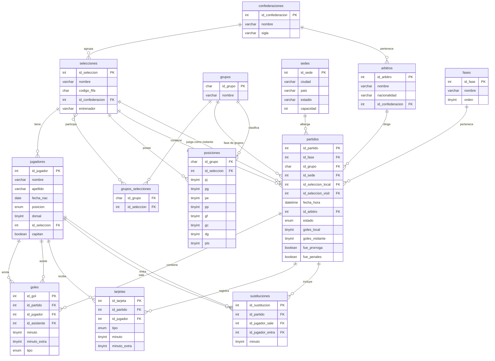

# Diagrama Entidad-Relación — Mundial FIFA 2026

## Descripción de relaciones clave

| Relación | Cardinalidad | Descripción |
|---|---|---|
| confederaciones → selecciones | 1:N | Cada confederación agrupa varias selecciones |
| confederaciones → arbitros | 1:N | Los árbitros pertenecen a una confederación |
| selecciones ↔ grupos | N:M | Mediante la tabla `grupos_selecciones` |
| grupos → posiciones | 1:N | Cada grupo tiene una fila de posición por selección |
| fases → partidos | 1:N | Un partido pertenece a una fase del torneo |
| sedes → partidos | 1:N | Una sede puede albergar múltiples partidos |
| partidos → goles | 1:N | Un partido puede tener cero o muchos goles |
| partidos → tarjetas | 1:N | Un partido puede tener cero o muchas tarjetas |
| jugadores → goles | 1:N | Un jugador puede anotar varios goles (también aparece como asistente) |
| jugadores → sustituciones | 1:N | Un jugador puede entrar o salir en distintos partidos |
